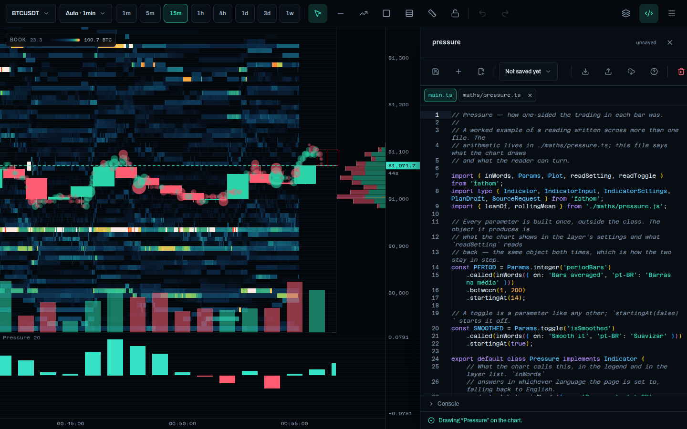

<h1 align="center">Fathom addons</h1>

<p align="center">
  <strong>Indicators for <a href="https://github.com/giovani-freitag/fathom">Fathom</a>, installed from a repository.</strong><br>
  Paste an address, see exactly what it holds, and it opens in the chart's own
  editor — source and all, yours to change. These are the worked ones.
</p>

<p align="center">
  
  ·
  
  ·
  
  ·
  
</p>

<p align="center">
  <strong>Press <em>Write a reading</em>, then the cloud button, and paste:</strong><br>
  <code>gh/giovani-freitag/fathom-addons/readings/pressure</code>
</p>

<p align="center">
  <a href="https://giovani-freitag.github.io/fathom-addons/"><strong>Or read them here first →</strong></a><br>
  <sub>Both files of both addons, on one page.</sub>
</p>

<p align="center">
  
</p>

Nothing installs itself. Fathom lists the files, where they came from and how
large before it fetches a byte, then checks each one against the hash the
listing gave. What arrives is a draft in your editor, marked unsaved.

## 📖 What is here

### 🌡️ [`pressure`](readings/pressure) — buying against selling, bar by bar

`(buy − sell) ÷ (buy + sell)` per bar, so a quiet hour and a busy one are
comparable, smoothed over a window you choose. Green above zero and red below,
in its own band under the chart — the strip in the shot above.

**Read it for:** an addon across two files · a numeric knob and a switch ·
warm-up bars declared so the left edge is not blank · `NaN` where there is no
honest answer.

### 🕰️ [`yesterday`](readings/yesterday) — where the last session opened, closed and turned

The previous day's or week's four levels, drawn over the price with the range
shaded between them.

**Read it for:** a coarser session declared and read back · the alignment that
makes repainting impossible · a choice parameter · shading between two series ·
saying you have nothing to draw yet.

## 🚀 Three ways in

| | |
|---|---|
| **From here** | Paste `gh/giovani-freitag/fathom-addons/readings/pressure` into the cloud button. An address copied out of GitHub works too. |
| **From a file** | Take a `.fathom.json` from a [release](https://github.com/giovani-freitag/fathom-addons/releases) and use the open button. Same addon, one file. |
| **By hand** | Open [`main.ts`](readings/pressure/main.ts) and copy it. No build step stands between the source and the chart. |

## 🔍 Why you can trust these

They are typechecked against **Fathom's real surface** — not a copy of it.
[Fathom itself](https://github.com/giovani-freitag/fathom) is a dependency of
this repository, and it packs nothing but the declarations its own build
generates, so `import { Plot } from 'fathom'` here resolves to exactly what the
in-page editor compiles against. One source of truth, no copy to keep current.

```bash
npm install
npm run check    # typecheck, lint, test
```

CI runs it on every push. An addon that stopped compiling against Fathom cannot
sit here looking fine.

## 🛠️ Working on them

```bash
npm run dev      # read them in the browser, source and all
npm run build    # bundles into dist/bundles, the page into dist
```

Node 22 or newer.

**The addons are not compiled here, on purpose.** An addon is TypeScript that
Fathom's in-page compiler reads; shipping JavaScript would produce something the
editor could not show and nobody could learn from. The build produces
`dist/bundles/*.fathom.json` — every file of an addon under one envelope — and
the page that reads them, bundled by Vite 8, which bundles with Rolldown.

## ✏️ Writing your own

The [**guide**](https://giovani-freitag.github.io/fathom/guide/writing-a-reading)
goes from the smallest addon that draws to the parts you reach for last, and the
[**API reference**](https://giovani-freitag.github.io/fathom/guide/api/) is
generated from the same types this repository is checked against.

The whole of it in four lines:

- An addon starts at `main.ts`, and its default export is the indicator.
- It imports from `'fathom'` and from its own files, and from nothing else.
  **There is no npm inside an addon.**
- `compute` is arithmetic and nothing else — no fetching, no timers, nothing
  remembered between calls. It runs again on every bar, pan and zoom.
- Anything the chart must fetch for you is declared in `resolveSources`.

The smallest one that draws:

```ts
import { Plot } from 'fathom';
import type { Indicator, IndicatorInput, PlanDraft } from 'fathom';

export default class Midpoint implements Indicator {
    readonly label = 'Midpoint';
    readonly parameters = [];

    compute(input: IndicatorInput): PlanDraft {
        const middle = input.bars.bars.map((bar) => (bar.highPrice + bar.lowPrice) / 2);

        return Plot.over(input.bars).line(middle, 'Midpoint').overThePrice();
    }
}
```

Pull requests welcome, as long as `npm run check` passes and the addon teaches
something these two do not.
